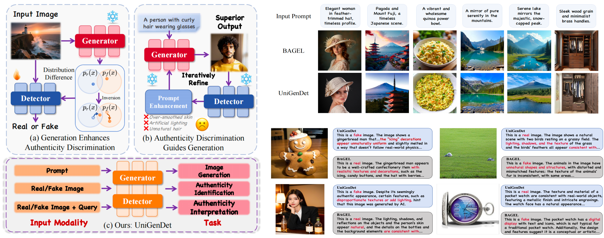

<p align="center">
  <h1 align="center">UniGenDet</h1>
  <h2 align="center"><b>A Unified Generative-Discriminative Framework for Co-Evolutionary Image Generation and Generated Image Detection</b></h2>
</p>

<p align="center">
  <b>
    <a href="https://github.com/Zhangyr2022/">Yanran Zhang</a>,
    <a href="https://wzzheng.net/#">Wenzhao Zheng</a><sup>†</sup>,
    <a href="https://joeleelyf.github.io/">Yifei Li</a>,
    <a href="https://yuby14.github.io/">Bingyao Yu</a>,
    <a href="https://yzheng97.github.io/">Yu Zheng</a>,
    <a href="https://leichenthu.github.io/">Lei Chen</a>,
    <a href="https://scholar.google.com/citations?user=6a79aPwAAAAJ&hl=en">Jie Zhou</a><sup>*</sup>,
    <a href="https://ivg.au.tsinghua.edu.cn/Jiwen_Lu/">Jiwen Lu</a>
  </b>
  <br/>
  Department of Automation, Tsinghua University, China
  <br/>
  <sup>*</sup>Corresponding author &nbsp;&nbsp; <sup>†</sup>Project leader
</p>

<h3 align="center"><b>CVPR 2026</b></h3>

<p align="center">
  <a href="https://github.com/Zhangyr2022/UniGenDet"></a>
  <a href="https://arxiv.org/abs/2604.21904v1"></a>
  <a href="https://ivg-yanranzhang.github.io/UniGenDet/"></a>
  <a href="https://www.modelscope.cn/models/YanranZhang/UniGenDet/summary"></a>
  <a href="https://huggingface.co/Yanran21/UniGenDet"></a>
</p>

<p align="center">
  
</p>

## Overview

Image generation and generated-image detection have both advanced rapidly, but mostly along separate technical paths: generation is dominated by generative architectures, while detection is dominated by discriminative ones. This separation creates a persistent gap in practice: generators are not directly optimized by forensic criteria, and detectors are often trained on static snapshots of old forgeries, which limits robustness to new generators.

UniGenDet addresses this gap with a unified co-evolutionary framework that jointly optimizes generation and detection in one loop. The core idea is to make both tasks explicitly exchange useful signals instead of evolving independently.

- **Symbiotic multimodal self-attention** bridges generation and authenticity understanding in a shared architecture.
- **Generation-detection unified fine-tuning (GDUF)** equips the detector with generative priors, improving generalization and interpretability.
- **Detector-informed generative alignment (DIGA)** feeds authenticity constraints back into synthesis, improving realism and fidelity.

In short, UniGenDet turns the traditional "generator vs. detector" arms race into a closed-loop collaboration. This repository provides the full training and evaluation pipeline built on pretrained BAGEL components.

## Installation

### 1. Clone and create environment

```bash
git clone https://github.com/Zhangyr2022/UniGenDet.git
cd UniGenDet

conda create -n unigendet python=3.10 -y
conda activate unigendet

pip install -r requirements.txt
pip install flash_attn==2.5.8 --no-build-isolation
```

### 2. Prepare pretrained checkpoints

Place required pretrained BAGEL weights in `pretrained/`.

```bash
# Optional: export HF_ENDPOINT=https://hf-mirror.com
huggingface-cli download ByteDance-Seed/BAGEL-7B-MoT --local-dir ./pretrained/bagel_7b_mot
```


## Unified Demo 🔥

The repository provides [demo.py](./demo.py) for two interactive modes:

- `t2i`: text-to-image generation
- `detection`: input a real/fake image and output a detection sentence

### Quick examples

Parameter notes:

- `--model_path`: directory of the base BAGEL pretrained assets (e.g., `llm_config.json`, `vit_config.json`, `ae.safetensors`, tokenizer files).
- `--ckpt_path`: path to your fine-tuned checkpoint. You can pass a single `.safetensors`, an index json, or a checkpoint directory containing all sharded files.

Text-to-image:

```bash
python demo.py \
  --mode t2i \
  --model_path ./pretrained/bagel_7b_mot \
  --ckpt_path /path/to/your_sharded_ckpt_dir  \
  --prompt "A cinematic portrait of a snow fox under moonlight" \
  --resolution 1024 \
  --output_dir ./results/demo
```

AI-Generated Image Detection (checkpoint directory path):

```bash
python demo.py \
  --mode detection \
  --model_path ./pretrained/bagel_7b_mot \
  --ckpt_path /path/to/your_sharded_ckpt_dir \
  --image ./assets/example.jpg
```

The example image (`assets/example.jpg`) is generated by the latest `GPT-Image-2` model, and UniGenDet produces the following detection output: "This is a fake image. The image shows a person sitting on a sidewalk with a backpack, but there are several unrealistic elements that suggest it is not a real photograph. The lighting and shadows do not align with a natural light source, and the colors appear overly saturated. The person's skin looks overly smooth and lacks natural texture, and the details of the clothing and backpack are not sharp and clear. The overall composition and quality of the image do not match what is typically seen in real photographs."

> If you encounter CUDA OOM, you can reduce GPU memory usage by lowering `max_memory_per_gpu` (this forces more aggressive CPU offloading, so it runs slower but can fit smaller cards).

## Data Preparation

### 1. Download datasets

We use a subset of [LAION Aesthetics](https://huggingface.co/datasets/dclure/laion-aesthetics-12m-umap) and [FakeClue](https://huggingface.co/datasets/lingcco/FakeClue) for training and evaluation.

Build LAION-style metadata first:

```bash
python scripts/data/laion_construction.py
```

> Note that due to some links being inaccessible, approximately half of the LAION samples cannot be downloaded. We recommend using the remaining available samples for training.

Then download FakeClue:

```bash
# Optional: export HF_ENDPOINT=https://hf-mirror.com
huggingface-cli download lingcco/FakeClue --local-dir ./datasets/fakeclue
```

### 2. Configure dataset paths

Edit path placeholders in:

- `data/dataset_info.py`
- `scripts/eval/*.sh`

Use valid absolute paths in your local environment (for example, `/path/to/datasets/...`).

### 3. Configure dataset mixture

Use task YAMLs:

- `data/configs/unigendet_DIGA.yaml`
- `data/configs/unigendet_GDUF.yaml`

These files define dataset groups, sampling weights, and image transform settings.

## Training

Before launch, set distributed arguments and checkpoint paths according to your cluster setup.


### A. GDUF training (generation-detection unified fine-tuning)

```bash
torchrun \
  --nnodes=1 \
  --node_rank=0 \
  --nproc_per_node=8 \
  train/pretrain_unified_navit_gduf.py \
  --dataset_config_file ./data/configs/unigendet_GDUF.yaml \
  --model_path /path/to/project/pretrained \
  --layer_module Qwen2MoTDecoderLayer \
  --max_latent_size 64 \
  --finetune_from_hf True \
  --auto_resume True \
  --resume-model-only True \
  --finetune-from-ema True \
  --lr 2e-5 \
  --results_dir results_gduf \
  --checkpoint_dir gduf
```

### B. DIGA training (detector-informed generative alignment)

```bash
torchrun \
  --nnodes=1 \
  --node_rank=0 \
  --nproc_per_node=8 \
  train/pretrain_unified_navit_diga.py \
  --dataset_config_file ./data/configs/unigendet_DIGA.yaml \
  --model_path /path/to/project/pretrained \
  --layer_module Qwen2MoTDecoderLayer \
  --max_latent_size 64 \
  --finetune_from_hf True \
  --auto_resume True \
  --resume-model-only True \
  --finetune-from-ema True \
  --lr 2e-5 \
  --visual_gen True \
  --visual_und False \
  --results_dir results_diga \
  --checkpoint_dir diga
```

### C. Script-based launch

```bash
bash scripts/train/train_GDUF.sh
bash scripts/train/train_DIGA.sh
```

### D. Practical notes

- Argument definitions follow the [BAGEL training design](https://github.com/ByteDance-Seed/Bagel/blob/main/TRAIN.md).
- Default recipes target a single node with 8 GPUs (80 GB VRAM each).
- Adjust `--nnodes`, `--nproc_per_node`, and all path arguments to match your setup.
- If you hit out-of-memory issues, reduce `--max_num_tokens`, `--expected_num_tokens`, and related token limits.

## Evaluation

### 1. Detection evaluation (FakeVLM)

The detection script evaluates UniGenDet on FakeVLM.

```bash
pip install rouge-score scikit-learn
bash scripts/eval/run_eval_fakevlm.sh
```

### 2. Generation evaluation on LAION-style prompts

Use a LAION split that does not overlap with your training subset to evaluate generalization.

```bash
pip install pytorch-fid
bash scripts/eval/run_laion.sh
```

### 3. GenEval benchmark

Before running, set up the environment by referring to [BAGEL EVAL.md](https://github.com/ByteDance-Seed/Bagel/blob/main/EVAL.md#geneval).

```bash
bash scripts/eval/run_geneval.sh
```

## Key Implementation Notes

- `max_latent_size=64` is recommended in the released BAGEL-based setup.
- Ensure `num_used_data` in YAML is larger than `NUM_GPUS x NUM_WORKERS` for stable sampling.
- For generation-only training, set `visual_und=False`.
- For memory-constrained debugging, reduce `expected_num_tokens`, `max_num_tokens`, and `max_num_tokens_per_sample`.

## Acknowledgement

This project is built upon the open-source [BAGEL](https://github.com/bytedance-seed/BAGEL) ecosystem and related multimodal tooling. We thank the original authors and community contributors.

## Citation

If you find this repository useful, please cite:

```bibtex
@article{zhang2026unigendet,
  title   = {UniGenDet: A Unified Generative-Discriminative Framework for Co-Evolutionary Image Generation and Generated Image Detection},
  author  = {Zhang, Yanran and Zheng, Wenzhao and Li, Yifei and Yu, Bingyao and Zheng, Yu and Chen, Lei and Zhou, Jie and Lu, Jiwen},
  journal = {CoRR},
  volume  = {abs/2604.21904},
  year    = {2026},
  url     = {https://arxiv.org/abs/2604.21904},
}
```

## License

This repository follows the license terms specified in `LICENSE`.
